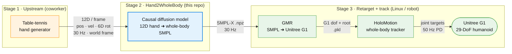
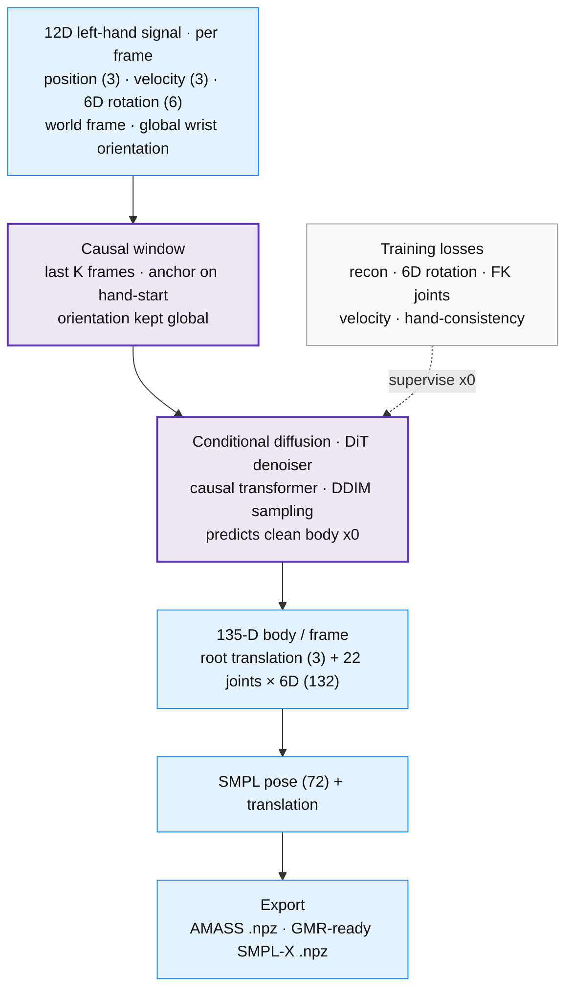
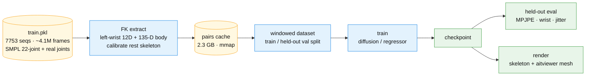

# Hand2WholeBody

Generate **whole-body SMPL motion** from a **single left-hand 12D signal**, for the
table-tennis humanoid pipeline:



- **Input** (per frame, left wrist = SMPL joint 20): `[pos(3), lin_vel(3), rot6D(6)]`,
  world frame, **global** wrist orientation. Forehand/backhand is encoded by that
  orientation.
- **Output**: AMASS-style SMPL `.npz` at 30 Hz (plain SMPL — rigid wrist, no fingers).
- **Causal / streaming** (real-time on the robot).

👉 **Read [`docs/CONTRACT.md`](docs/CONTRACT.md) first** — it pins the world frame, the 12D
semantics, the SMPL output format, and the open questions for the coworker. All code
constants come from [`configs/default.yaml`](configs/default.yaml).

## Model & I/O



## Training & data flow



## Status (2026-06-30)

| Milestone | State |
|-----------|-------|
| **M0** repo + env + frozen contract | ✅ scaffold, world frame, configs; torch 2.11+cu128 on GPU |
| **M1** SMPL→12D FK extractor + cycle-consistency | ✅ `h2wb/data/smpl_fk.py`, verified on synthetic data |
| **M2** deterministic regressor baseline | ✅ causal transformer + FK losses + training loop, verified on GPU |
| **M3** train on real data (train.pkl) | ✅ diffusion: **20.7 mm** held-out MPJPE, wrist ~8 mm / <1° — see [results.md](docs/results.md) |
| **M4** streaming diffusion (primary) | ✅ causal DiT denoiser + DDIM + streaming, verified on GPU; SAGE/distillation = polish |
| **M5** close the loop: SMPL→GMR→MuJoCo→HoloMotion | ◐ GMR-ready SMPL-X export + verified [runbook](docs/stage3_runbook.md); robot run is on user's Linux/G1 |
| **M6** domain-gap hardening | ⬜ |

6D rotation convention is **confirmed** = Zhou-2019 columns (`frames.PROJECT_R6D`). The
models train hand[1..L]→body[1..L] causally; run `python scripts/train.py --synthetic` to
smoke-test the loop without data.

**Real data** (`train.pkl`, joblib, SMPL 22-joint `poses [T,66]` + `trans`):
```
python scripts/train.py --pkl train.pkl --arch diffusion --steps 20000   # FK-extracts the 12D internally
python -m h2wb.export.aitviewer_vis --input train.pkl --seq_idx 0         # view raw data (aitviewer)
python scripts/generate.py --arch diffusion --checkpoint checkpoints/diffusion.pt --hand H.npy --out out.npz --viz out.png
python -m h2wb.export.aitviewer_vis --input out.npz                       # view a generated clip
```
**Mesh visualization (aitviewer).** One-time setup for the SMPL body-mesh render: download
the official SMPL models (`smpl.is.tue.mpg.de`), then convert + render:
```
python -m uv pip install --python .venv --no-build-isolation chumpy   # one-time, for the conversion
python scripts/clean_smpl_models.py --src .../SMPL_python_v.1.1.0/smpl/models --out .../smpl_models
python scripts/render_aitviewer.py --cache data/cache/pairs_full.npz \
    --checkpoint checkpoints/diffusion_full.pt --smpl-models .../smpl_models --out mesh.mp4
```
`clean_smpl_models.py` converts the chumpy/numpy-1 release into the `SMPL_{GENDER}.pkl` layout
smplx/aitviewer expect (and that works under numpy 2.x). The matplotlib `h2wb.export.visualize`
+ `scripts/render_video.py` are a schematic, dependency-light headless fallback (no models needed).

The representation core, FK extractor, the regressor + conditional diffusion models, losses,
dataset, caching, evaluation, and export are implemented and **tested** (`pytest` — 75 passing,
incl. overfit, generative, and FK-parity tests). Trained on real data (see [results.md](docs/results.md));
remaining is **M6** (domain-gap hardening) and the on-robot Stage-3 run on the user's Linux/G1.

## Layout

```
assets/urdf/        ball / table / g1_29dof_rev_1_0_pingpong  (world frame source of truth)
configs/            default.yaml
docs/CONTRACT.md    inter-stage data contract  ← the important doc
h2wb/
  representations/  rotations.py (6D/aa/quat, pluggable convention), frames.py (world, SMPL, 12D)
  data/             smpl_fk.py (SMPL→12D), dataset.py (windowed causal — stub)
  models/           diffmlp.py / streaming.py / regressor.py (interfaces)
  losses.py         recon + 6D + FK + jitter + hand-consistency + foot-contact
  export/           to_amass_npz.py (SMPL→AMASS .npz for GMR/HoloMotion)
scripts/            setup_env.ps1, extract_amass.py, train.py
tests/              representation + FK tests (run with pytest)
```

## Setup

The system Python is 3.14 (no torch wheels yet). Use the project venv (Python 3.12, via
`uv`) — already created at `.venv`:

```powershell
# core (done): numpy, pyyaml, pytest, editable install
# heavy ML stack (Blackwell GPU → cu128 torch):
python -m uv pip install --python .venv --index-url https://download.pytorch.org/whl/cu128 torch
python -m uv pip install --python .venv -e ".[train,dev]"   # smplx, trimesh, tqdm, ...

# run tests
$env:PYTHONPATH = (Get-Location).Path
.venv\Scripts\python.exe -m pytest -q
```

> Note: GMR / HoloMotion themselves run best under Linux/WSL2. Hand2WholeBody training
> and the SMPL export are platform-independent; the Stage-3 retarget happens downstream.
