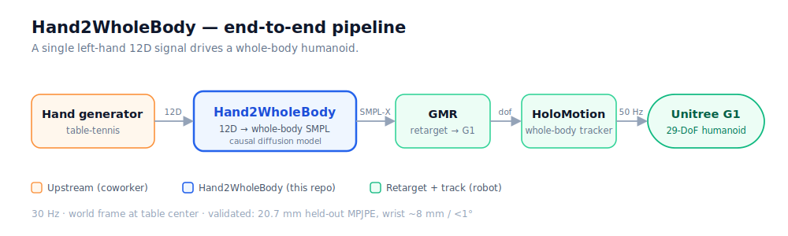
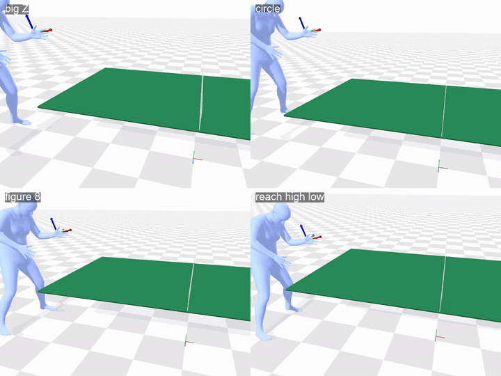
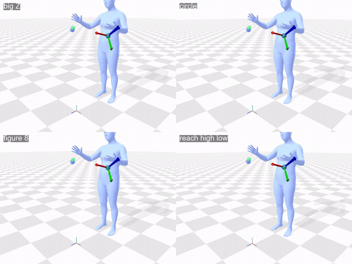
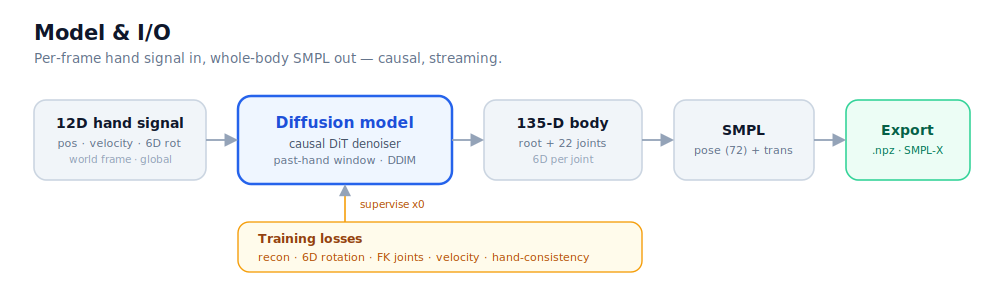
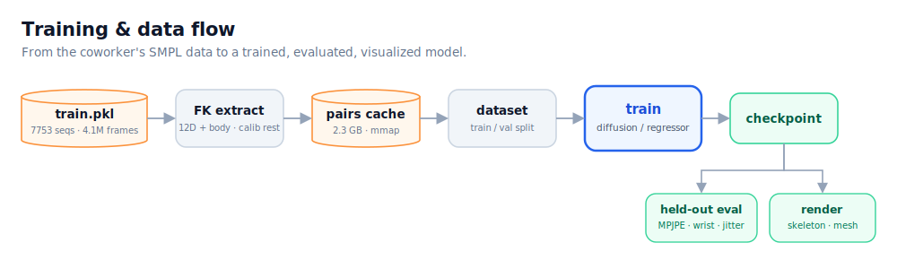

# Hand2Body

Generate **whole-body SMPL motion** from **sparse wrist tracking** — a general
*sparse-tracking → full-body* model (the AGRoL / AvatarPoser lineage, taken to its
extreme-sparse end). Drive it from **one wrist** (12D) or **both wrists** (24D); the same
causal diffusion model lifts the wrist signal(s) to the whole body in real time. Two
example applications: a table-tennis paddle hand, and bimanual object manipulation.

<p align="center"></p>

- **Input** (per frame, per tracked wrist = SMPL joint 20 / 21): `[pos(3), lin_vel(3), rot6D(6)]`,
  world frame, **global** wrist orientation. 1 wrist → 12D, 2 wrists → 24D (`hand_signal.wrist_count`;
  `--wrist-count`). Blocks are `[left12 | right12]`.
- **Output**: whole-body SMPL (135-D = root_trans + 22 joints × 6D) / AMASS-style `.npz` at 30 Hz
  (plain SMPL — rigid wrist, no fingers).
- **Causal / streaming** (real-time, ~5 ms/frame — `h2b.models.streaming`).

### Trained instances (weights in [Releases](https://github.com/zxpeng2007/Hand2Body/releases/tag/v0.1.0))

| model | input | data | held-out |
|---|---|---|---|
| `diffusion_full.pt` | **1 wrist** (12D, left paddle) | table tennis | **20.7 mm** MPJPE, 8.5 mm / 0.72° wrist |
| `arctic_bimanual_30k.pt` | **2 wrists** (24D) | ARCTIC bimanual manipulation | ~63 mm MPJPE, **14 mm / 2.1°** wrist |

Wrist tracking (upper body) is tight in both; the two-wrist MPJPE floor (~63 mm) is the **unconstrained
lower body** — no wrist observes the legs/root, so they stay prior-driven (the fundamental limit of
sparse-wrist tracking). Table tennis is one instantiation; the world-frame/table/ball specifics live in
[`docs/CONTRACT.md`](docs/CONTRACT.md).

### See it move — generalization probe

Synthetic wrist commands that exist nowhere in the training data (big Z, circle, figure-8,
high/low reach), drawn inside each model's workspace by
[`scripts/shape_probe.py`](scripts/shape_probe.py) `--render`. Red = commanded wrist
(sphere + orientation gizmo + trail), cyan = generated wrist; in the bimanual clips the idle
second hand is the blue/green ghost pair. Both models keep tracking; each answers with its own
domain prior.

**1 wrist, table-tennis model** — interprets unfamiliar wrist paths as a reason to *step* (footwork):

<p align="center"></p>

**2 wrists, ARCTIC bimanual model** — same shapes, *planted feet*: weight shifts and torso lean instead of steps:

<p align="center"></p>

Numbers and the (load-bearing) anchor-height caveat: [`docs/results.md`](docs/results.md).

👉 **Read [`docs/CONTRACT.md`](docs/CONTRACT.md)** for the table-tennis instantiation (world frame, 12D
semantics, SMPL output). All code constants come from [`configs/default.yaml`](configs/default.yaml).

## Model & I/O

<p align="center"></p>

## Training & data flow

<p align="center"></p>

## Pretrained models

Weights are published as **[GitHub Release](https://github.com/zxpeng2007/Hand2Body/releases/tag/v0.1.0)**
assets (kept out of git history):

```bash
gh release download v0.1.0 -p diffusion_full.pt -D checkpoints        # 1-wrist (12D), table tennis
gh release download v0.1.0 -p arctic_bimanual_30k.pt -D checkpoints   # 2-wrist (24D), bimanual manip
```

Construct the matching model (`hand_dim = 12 × #wrists`) and load:

```python
import torch
from h2b.models.diffusion import DiTDenoiser
m = DiTDenoiser(hidden=256, n_layers=4, hand_dim=24).eval()           # 12 for the 1-wrist model
m.load_state_dict(torch.load("checkpoints/arctic_bimanual_30k.pt", map_location="cpu"))
```

## Quickstart

The 6D convention is Zhou-2019 columns (`frames.PROJECT_R6D`); the models map
`hand[1..L] → body[1..L]` causally. The table-tennis motion set is a joblib pickle of SMPL 22-joint
`poses [T,66]` + `trans`. Measured results: [results.md](docs/results.md). Run the suite with `pytest`.

```bash
python scripts/train.py --synthetic                                          # smoke-test the loop, no data
# 1 wrist (table tennis) — FK-extracts the 12D from whole-body SMPL:
python scripts/train.py --pkl motions.pkl --arch diffusion --steps 30000
# 2 wrists (bimanual manipulation) — FK-extracts the 24D from ARCTIC SMPL-X:
python scripts/train.py --arctic <arctic_raw_seqs> --smplx-models <smplx_dir> --wrist-count 2 --arch diffusion --steps 30000
python scripts/generate.py --arch diffusion --checkpoint checkpoints/diffusion_full.pt --hand H.npy --out out.npz
python -m h2b.export.aitviewer_vis --input out.npz                          # view a generated clip
```

### Mesh visualization (aitviewer)

One-time setup for the SMPL body-mesh render: download the official SMPL models
(`smpl.is.tue.mpg.de`), then convert + render:

```bash
python -m uv pip install --python .venv --no-build-isolation chumpy    # one-time, for the conversion
python scripts/clean_smpl_models.py --src .../SMPL_python_v.1.1.0/smpl/models --out .../smpl_models
python scripts/render_aitviewer.py --cache data/cache/pairs_full.npz \
    --checkpoint checkpoints/diffusion_full.pt --smpl-models .../smpl_models --out mesh.mp4
```

`clean_smpl_models.py` converts the chumpy/numpy-1 release into the `SMPL_{GENDER}.pkl` layout
smplx/aitviewer expect (works under numpy 2.x). `h2b.export.visualize` + `scripts/render_video.py`
are a schematic, dependency-light headless fallback (no models needed).

## Layout

```
assets/urdf/        ball · table · g1 pingpong   (world-frame source of truth)
configs/            default.yaml
docs/               CONTRACT.md (data contract) · stage3_runbook.md (GMR→HoloMotion) · results.md · img/
h2b/
  representations/  rotations, frames (world/SMPL/N-wrist 12D·24D), body (135-D), rotations_torch
  data/             smpl_fk (SMPL→12D/24D), pkl_loader (table-tennis SMPL), arctic_loader (ARCTIC SMPL-X),
                    cache, dataset
  models/           diffusion (DiT denoiser, hand_dim=12·24), regressor, fk_torch, streaming
  losses.py · inference.py · training.py · eval.py
  export/           to_amass_npz (SMPL/SMPL-X), aitviewer_vis, visualize
scripts/            train (--pkl · --arctic · --wrist-count) · generate · render_aitviewer ·
                    render_video · cache_pairs · clean_smpl_models · compare_models · inspect_pkl ·
                    shape_probe (generalization probe: synthetic wrist shapes → body)
tests/              pytest suite
```

## Setup

Use a Python 3.12 venv via `uv` (PyTorch needs the cu128 build on Blackwell GPUs):

```powershell
python -m uv venv --python 3.12 .venv
python -m uv pip install --python .venv -e ".[dev]"                                                # numpy, pyyaml, pytest
python -m uv pip install --python .venv --index-url https://download.pytorch.org/whl/cu128 torch   # GPU build
python -m uv pip install --python .venv -e ".[train]"                                              # smplx, trimesh, tqdm

$env:PYTHONPATH = (Get-Location).Path
.venv\Scripts\python.exe -m pytest -q
```

> Note: GMR / HoloMotion themselves run best under Linux/WSL2. Hand2Body training
> and the SMPL export are platform-independent; the Stage-3 retarget happens downstream.
